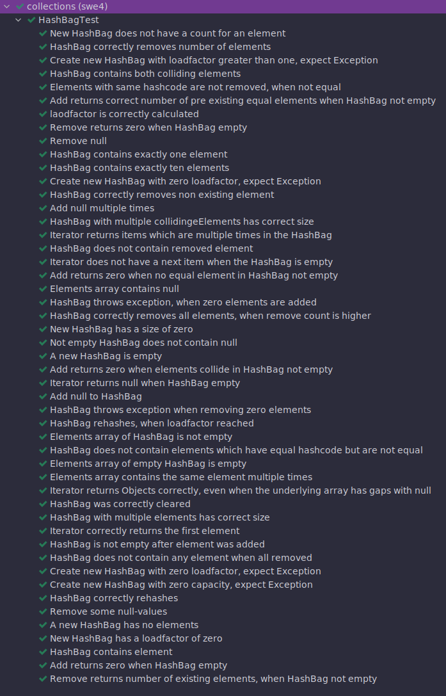
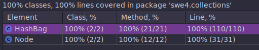

= Übung 03
:author: Florian Weingartshofer
:email: <S1910307103@students.fh-hagenberg.at>
:reproducible:
:experimental:
:listing-caption: Listing
:source-highlighter: rouge
:src: ../src/hashbag/src/main/java/swe4/collections
:test: ../src/hashbag/src/test/java/swe4/collections
:imgdir: ./img
:imagesoutdir: ./out
:stem:
:toc:
:numbered:

<<<
== Lösungsidee
=== HashBag
Wie in der Angabe vorgegeben wird ein HashBag implementiert.
Um zu überprüfen, ob das Interface korrekt implementiert wurde,
implementiert der HashBag das Bag Interface.
Dieses ist ein Iterable und gibt alle weiteren benötigten Methoden des HashBags an.

Für die lineare Verkettung wird eine Single Linked List genutzt,
diese ist genauso generisch wie der HashBag selbst.

Es wird beim Entfernen und Zählen der einzelnen Elemente darauf geachtet, ob diese auch ident sind.

Zusätzlich zu den vom Interface vorgegebenen Methoden gibt es zwei private.

* `elementAt` gibt das Element an der Stelle `index` im Array zurück und führt gleichzeitig einen Typecast durch.

* `hashToIndex` berechnet aus einem Objekt den Hash und weiter den Index für den HashBag.

=== Test Cases
Zum Testen wird das `SetHashObject` genutzt. Mit diesem kann man Hash Kollisionen provozieren,
obwohl das Objekt nicht ident ist.
Außerdem kann man relativ einfach und flexibel vorhersagbare Hash-Werte übergeben.
Somit wird viel Zeit mit Suchen nach Kollisionen usw. gespart.

<<<
== Source-Code

.Node.java
[source,java]
----
include::{src}/Node.java[]
----

.Bag.java
[source,java]
----
include::{src}/Bag.java[]
----

.HashBag.java
[source,java]
----
include::{src}/HashBag.java[]
----

== Test Cases
Was beim Testen erwartet wird zeigen die JUnit Tests selber sehr gut,
daher füge ich am Ende eine gesammelte Testauswertung ein.

Mit den Tests wird eine 100% Line Coverage erzielt, allerdings ist die Branch Coverage niedriger.
Es liegt dem Projekt auch ein Gradle File bei, mit dem ein Jacoco Test Report erstellt werden kann.

.SetHashObject.java
[source,java]
----
include::{test}/SetHashObject.java[]
----

.HashBagTest.java
[source,java]
----
include::{test}/HashBagTest.java[]
----

.Tests Output
[source]
----
Executing test newHashBagCountsZeroElements() [swe4.collections.HashBagTest] with result: SUCCESS
Executing test hashBagCorrectlyRemovesNumberOfElements() [swe4.collections.HashBagTest] with result: SUCCESS
Executing test newHashBagLoadFactorGreaterOne_expectException() [swe4.collections.HashBagTest] with result: SUCCESS
Executing test hashBagWithCollisionCheckIfExistingElementIsPresent() [swe4.collections.HashBagTest] with result: SUCCESS
Executing test elementWhichHasSameHashCodeIsNotRemoved() [swe4.collections.HashBagTest] with result: SUCCESS
Executing test addReturnsCorrectNumber_whenHashbagNotEmpty() [swe4.collections.HashBagTest] with result: SUCCESS
Executing test loadFactorIsCorrectIfHalfIsFilled() [swe4.collections.HashBagTest] with result: SUCCESS
Executing test removeReturnsZero_whenHashBagEmpty() [swe4.collections.HashBagTest] with result: SUCCESS
Executing test removeNullValueFromHashBag() [swe4.collections.HashBagTest] with result: SUCCESS
Executing test hashBagContainsExactlyOneElement() [swe4.collections.HashBagTest] with result: SUCCESS
Executing test hashBagContainsExactlyTenElements() [swe4.collections.HashBagTest] with result: SUCCESS
Executing test newHashBagLoadFactorEqualZero_expectException() [swe4.collections.HashBagTest] with result: SUCCESS
Executing test removeNotExistingElement() [swe4.collections.HashBagTest] with result: SUCCESS
Executing test addMultipleNullValuesToHashBag() [swe4.collections.HashBagTest] with result: SUCCESS
Executing test hashBagWithCollisionAndMultipleElementsHasCorrectSize() [swe4.collections.HashBagTest] with result: SUCCESS
Executing test iteratorReturnsMultipleEntries() [swe4.collections.HashBagTest] with result: SUCCESS
Executing test hashBagDoesNotContainElementWhenRemoved() [swe4.collections.HashBagTest] with result: SUCCESS
Executing test iteratorDoesNotHaveNext_whenHashBagEmpty() [swe4.collections.HashBagTest] with result: SUCCESS
Executing test addReturnZero_whenNoEqualElementInHashBag() [swe4.collections.HashBagTest] with result: SUCCESS
Executing test elementsContainsNullValues() [swe4.collections.HashBagTest] with result: SUCCESS
Executing test addZeroElements_expectException() [swe4.collections.HashBagTest] with result: SUCCESS
Executing test removeMoreElementsThanInHashBag() [swe4.collections.HashBagTest] with result: SUCCESS
Executing test newHashBagHasZeroSize() [swe4.collections.HashBagTest] with result: SUCCESS
Executing test hashBagDoesNotContainNullWhenNotEmpty() [swe4.collections.HashBagTest] with result: SUCCESS
Executing test newHashBagIsEmpty() [swe4.collections.HashBagTest] with result: SUCCESS
Executing test addReturnZero_whenElementsCollideInHashBag() [swe4.collections.HashBagTest] with result: SUCCESS
Executing test iteratorReturnsNull_whenHashBagEmpty() [swe4.collections.HashBagTest] with result: SUCCESS
Executing test addNullToHashBag() [swe4.collections.HashBagTest] with result: SUCCESS
Executing test removeZeroElements_expectException() [swe4.collections.HashBagTest] with result: SUCCESS
Executing test hashBagRehashesWhenLoadfactorReached() [swe4.collections.HashBagTest] with result: SUCCESS
Executing test hashBagElementsContainsElements() [swe4.collections.HashBagTest] with result: SUCCESS
Executing test hashBagWithCollisionCheckIfNonExistingElementIsNotPresent() [swe4.collections.HashBagTest] with result: SUCCESS
Executing test newHashBagElementsIsEmpty() [swe4.collections.HashBagTest] with result: SUCCESS
Executing test checkIfElementsContainsSameElementMultipleTimes() [swe4.collections.HashBagTest] with result: SUCCESS
Executing test iteratorReturnsElements_whenHashBagHasGaps() [swe4.collections.HashBagTest] with result: SUCCESS
Executing test clearedHashBagIsCompletelyEmpty() [swe4.collections.HashBagTest] with result: SUCCESS
Executing test hashBagWithMultipleElementsHasCorrectSize() [swe4.collections.HashBagTest] with result: SUCCESS
Executing test iteratorReturnsFirstElement() [swe4.collections.HashBagTest] with result: SUCCESS
Executing test hashBagIsNotEmpty() [swe4.collections.HashBagTest] with result: SUCCESS
Executing test hashBagContainsNoElementWhenAllRemove() [swe4.collections.HashBagTest] with result: SUCCESS
Executing test iteratorHasNotNext_whenHashBagEmpty() [swe4.collections.HashBagTest] with result: SUCCESS
Executing test newHashBagCapacitySmallerZero_expectException() [swe4.collections.HashBagTest] with result: SUCCESS
Executing test hashBagRehash() [swe4.collections.HashBagTest] with result: SUCCESS
Executing test removePartOfTheNullValueFromHashBag() [swe4.collections.HashBagTest] with result: SUCCESS
Executing test newHashBagContainsNoElement() [swe4.collections.HashBagTest] with result: SUCCESS
Executing test newHashBagHasZeroLoadFactor() [swe4.collections.HashBagTest] with result: SUCCESS
Executing test hashBagContainsElement() [swe4.collections.HashBagTest] with result: SUCCESS
Executing test addReturnsZero_whenHashbagEmpty() [swe4.collections.HashBagTest] with result: SUCCESS
Executing test removeReturnsNumberOfExistingElements_whenHashBagNotEmpty() [swe4.collections.HashBagTest] with result: SUCCESS
----

.IntelliJ Output

.IntelliJ Coverage

