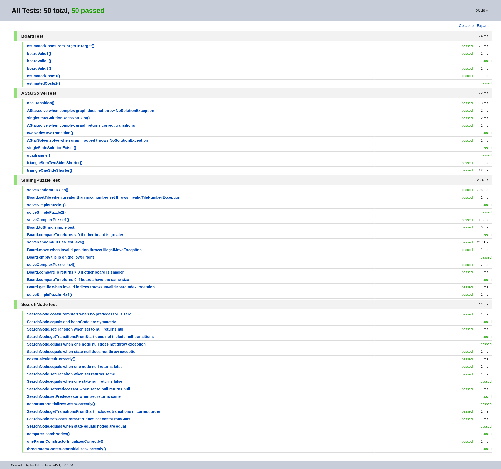
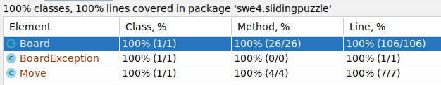

= Übung 04
:author: Florian Weingartshofer
:email: <S1910307103@students.fh-hagenberg.at>
:reproducible:
:experimental:
:listing-caption: Listing
:source-highlighter: rouge
:src: ../src/astar/src/main/java/swe4
:test: ../src/astar/src/test/java/swe4
:imgdir: ./img
:imagesoutdir: ./out
:stem:
:toc:
:numbered:

== Lösungsidee
Einige Zeit ist in das Refactoring des Projekts in ein Standard Maven eingeflossen, da ich dieses Projektlayout wesentlich intuitiver finde.
Die Tests sind besser vom eigentlichen Code getrennt.
Außerdem liegt dem Projekt ein Gradle File, welches Jacoco inkludiert, um leicht die Test Coverage nachzuprüfen.

Bezüglich der Schnittstellen gibt es einige Widersprüche,
wie zB Rückgabe-Wert im Setter und manchmal das Weglassen der Deklaration der Exceptions in der Methoden Signatur.

=== AStar
Die Datenstrukturen und Algorithmen sind alle in der Angabe genau beschrieben. Der AStar Algorithmus ist stark an diese Python Implementierung angelehnt: https://github.com/flohero/se-ams/blob/master/lab/ueb04/ueb04.ipynb.

=== Sliding Puzzle
Das Sliding Puzzle war auch sehr klar vorgegeben.
Ich habe allerdings versucht in der Klasse selbst Indizes zu vermeiden die bei 1 beginnen, da ich es bei
Java für sehr unintuitiv halte.

=== Sliding Puzzle

== Code
=== AStar

.SearchNode.java
[source,java]
----
include::{src}/astar/SearchNode.java[]
----

.AStarSolver.java
[source,java]
----
include::{src}/astar/AStarSolver.java[]
----

.NoSolutionException.java
[source,java]
----
include::{src}/astar/NoSolutionException.java[]
----

=== Sliding Puzzle
.Move.java
[source,java]
----
include::{src}/slidingpuzzle/Move.java[]
----

.Board.java
[source,java]
----
include::{src}/slidingpuzzle/Board.java[]
----

.BoardException.java
[source,java]
----
include::{src}/slidingpuzzle/BoardException.java[]
----

.IllegalMoveException.java
[source,java]
----
include::{src}/slidingpuzzle/IllegalMoveException.java[]
----

.InvalidBoardIndexException.java
[source,java]
----
include::{src}/slidingpuzzle/InvalidBoardIndexException.java[]
----

.InvalidTileNumberException.java
[source,java]
----
include::{src}/slidingpuzzle/InvalidTileNumberException.java[]
----

.Main.java
[source,java]
----
include::{src}/slidingpuzzle/Main.java[]
----

== Test Cases
=== AStar
.SearchNodeTest.java
[source,java]
----
include::{test}/astar/SearchNodeTest.java[]
----

.AStarSolverTest.java
[source,java]
----
include::{test}/astar/AStarSolverTest.java[]
----

=== Sliding Puzzle
.BoardTest.java
[source,java]
----
include::{test}/slidingpuzzle/BoardTest.java[]
----

.SlidingPuzzleTest.java
[source,java]
----
include::{test}/slidingpuzzle/SlidingPuzzleTest.java[]
----

<<<
=== Reports

