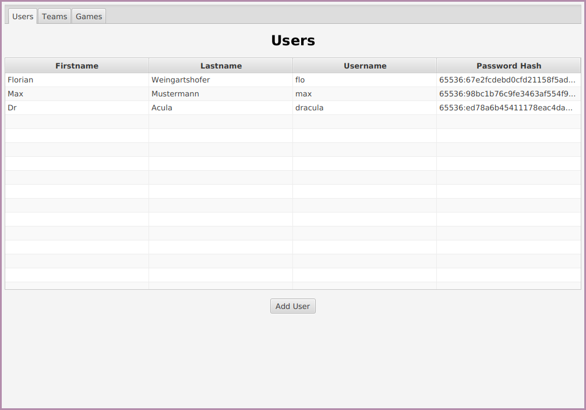
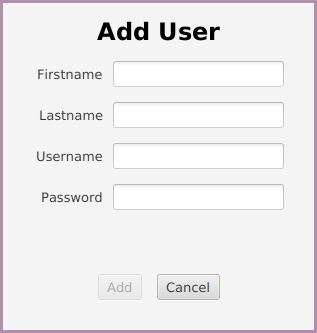
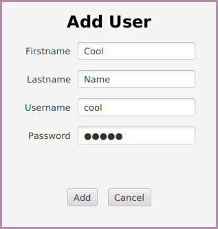
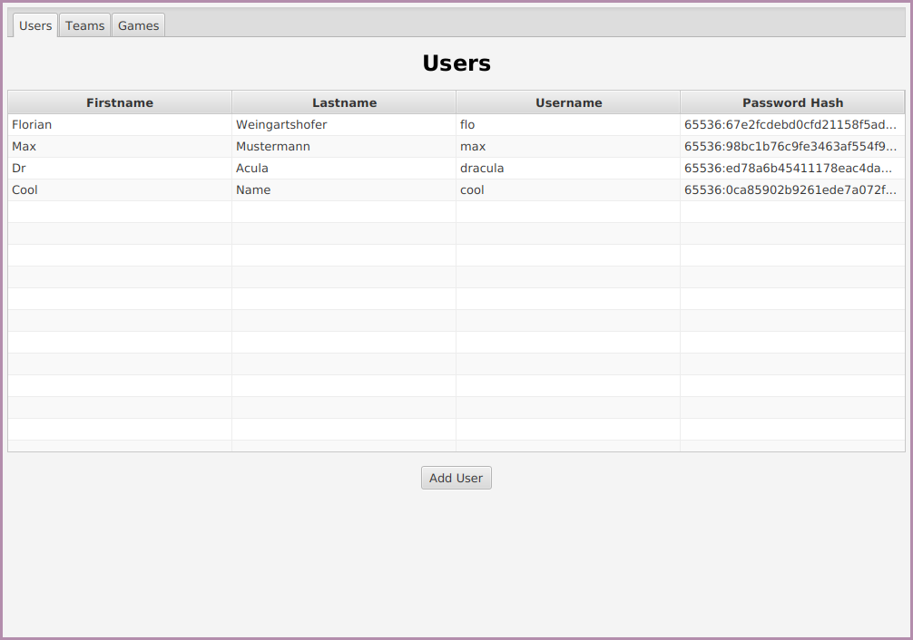
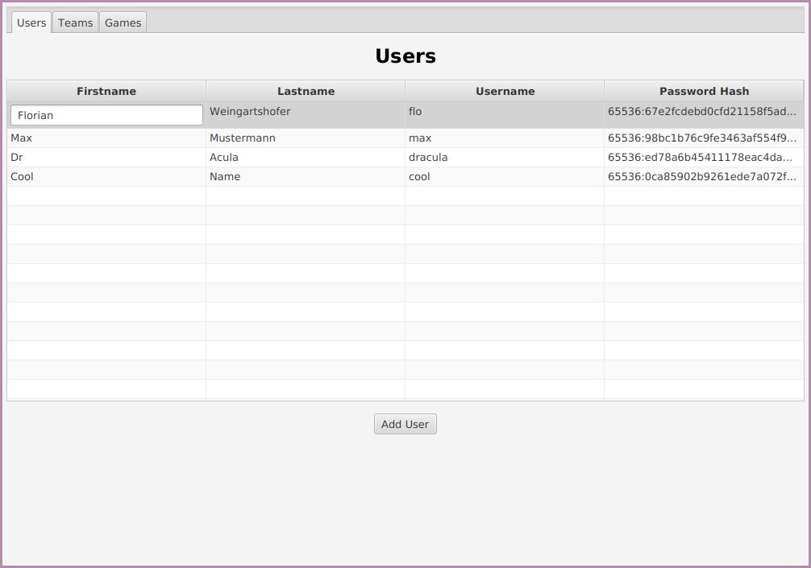
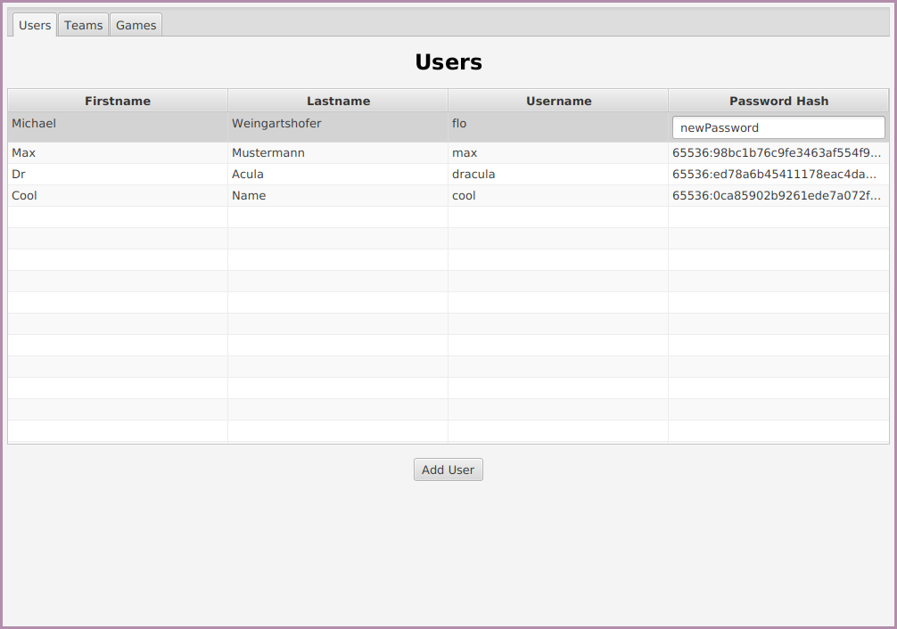
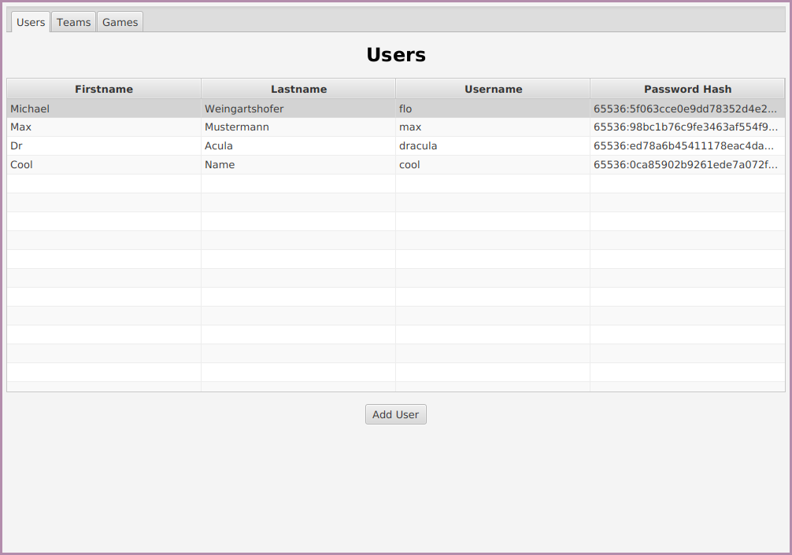
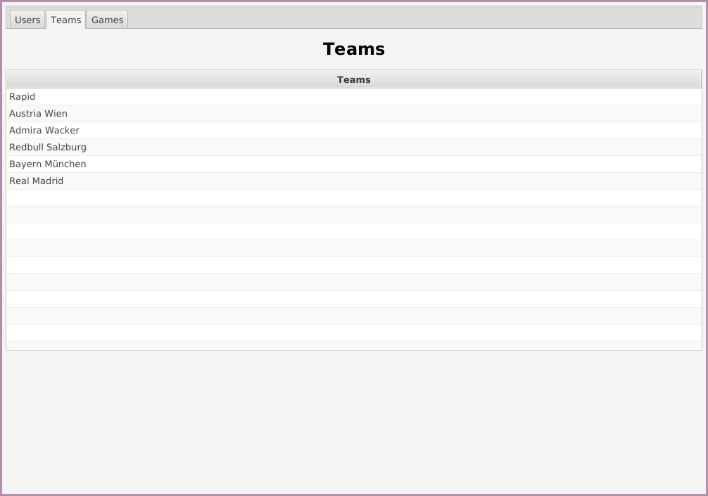
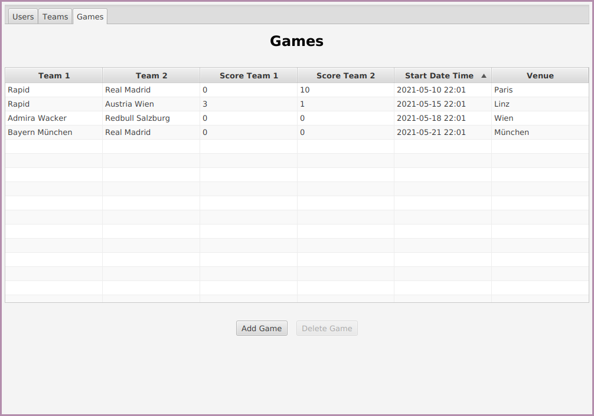

= Übung 05
:author: Florian Weingartshofer
:email: <S1910307103@students.fh-hagenberg.at>
:reproducible:
:experimental:
:listing-caption: Listing
:source-highlighter: rouge
:src: ../src/euro-bet-ui/src/main/java/swe4
:fxml: ../src/euro-bet-ui/src/main/resources/swe4
:img: ./img
:imagesoutdir: ./out
:stem:
:toc:
:numbered:

<<<
== Lösungsidee
Es wird wie laut Angabe ein Tool zur Verwaltung und eine Wettanwendung geschrieben.
Diese sind eigenständig und werden getrennt voneinander ausgeführt.
Zum Speichern wird das Repository Pattern genutzt, gemeinsam mit dem Factory Pattern.

=== User
Der

<<<
== Mock-Ups
=== Bet Application
.Login
image::{img}/login.png[]

.Bet-View
image::{img}/betView.png[]

.Highscore
image::{img}/highscore.png[]

=== Management Tool
.Users-View
image::{img}/users.png[]

.Teams-View
image::{img}/users.png[]

.Games-View
image::{img}/users.png[]

.Dialogs
image::{img}/dialogs.png[]

<<<
== Source Code
=== domain

.User
[source,java]
----
include::{src}/domain/User.java[]
----

.Team
[source,java]
----
include::{src}/domain/Team.java[]
----

.Game
[source,java]
----
include::{src}/domain/Game.java[]
----

.PlacementTime
[source,java]
----
include::{src}/domain/PlacementTime.java[]
----

.Bet
[source,java]
----
include::{src}/domain/Bet.java[]
----

<<<
=== Repositories
.UserRepository
[source,java]
----
include::{src}/repositories/UserRepository.java[]
----

.FakeUserRepository
[source,java]
----
include::{src}/repositories/FakeUserRepository.java[]
----

.TeamRepository
[source,java]
----
include::{src}/repositories/TeamRepository.java[]
----

.FakeTeamRepository
[source,java]
----
include::{src}/repositories/FakeTeamRepository.java[]
----

.GameRepository
[source,java]
----
include::{src}/repositories/GameRepository.java[]
----

.FakeGameRepository
[source,java]
----
include::{src}/repositories/FakeGameRepository.java[]
----

.BetRepository
[source,java]
----
include::{src}/repositories/BetRepository.java[]
----

.FakeBetRepository
[source,java]
----
include::{src}/repositories/FakeBetRepository.java[]
----

.RepositoryFactory
[source,java]
----
include::{src}/repositories/RepositoryFactory.java[]
----

<<<
=== services
.UserService
[source,java]
----
include::{src}/services/UserService.java[]
----

.StateService
[source,java]
----
include::{src}/services/StateService.java[]
----

.LoadFakeDataService
[source,java]
----
include::{src}/services/LoadFakeDataService.java[]
----

<<<
=== utils
.DialogUtils
[source,java]
----
include::{src}/utils/DialogUtils.java[]
----

.TimeUtils
[source,java]
----
include::{src}/utils/TimeUtils.java[]
----

.WindowUtils
[source,java]
----
include::{src}/utils/WindowUtils.java[]
----

.TableCellData
[source,java]
----
include::{src}/utils/TableDateCell.java[]
----

<<<
=== managementtool

.ManagementTool
[source,java]
----
include::{src}/managementtool/ManagementTool.java[]
----

.BaseDialog
[source,java]
----
include::{src}/managementtool/controllers/BaseDialogController.java[]
----

.Dashboard
[source,xml]
----
include::{fxml}/managementtool/Dashboard.fxml[]
----

.DashboardController
[source,java]
----
include::{src}/managementtool/controllers/DashboardController.java[]
----

.AddGameDialog
[source,xml]
----
include::{fxml}/managementtool/AddGameDialog.fxml[]
----

.AddGameDialogController
[source,java]
----
include::{src}/managementtool/controllers/AddGameDialogController.java[]
----

.AddUserDialog
[source,xml]
----
include::{fxml}/managementtool/AddGameDialog.fxml[]
----

.AddUserDialogController
[source,java]
----
include::{src}/managementtool/controllers/AddUserDialogController.java[]
----

.GameView
[source,xml]
----
include::{fxml}/managementtool/GameView.fxml[]
----

.GameViewController
[source,java]
----
include::{src}/managementtool/controllers/GameViewController.java[]
----

.TeamView
[source,xml]
----
include::{fxml}/managementtool/TeamView.fxml[]
----

.TeamViewController
[source,java]
----
include::{src}/managementtool/controllers/TeamViewController.java[]
----

.UserView
[source,xml]
----
include::{fxml}/managementtool/UserView.fxml[]
----

.UserViewController
[source,java]
----
include::{src}/managementtool/controllers/UserViewController.java[]
----

<<<
=== betapplication

.BetApplication
[source,java]
----
include::{src}/betapplication/BetApplication.java[]
----

.BetDashboard
[source,xml]
----
include::{fxml}/betapplication/BetDashboard.fxml[]
----

.BetDashboard
[source,java]
----
include::{src}/betapplication/controllers/BetDashboardController.java[]
----

.BetView
[source,xml]
----
include::{fxml}/betapplication/BetView.fxml[]
----

.BetViewController
[source,java]
----
include::{src}/betapplication/controllers/BetViewController.java[]
----

.HighscoreView
[source,xml]
----
include::{fxml}/betapplication/HighscoreView.fxml[]
----

.HighscoreViewController
[source,java]
----
include::{src}/betapplication/controllers/HighscoreViewController.java[]
----

.LoginView
[source,xml]
----
include::{fxml}/betapplication/LoginView.fxml[]
----

.LoginViewController
[source,java]
----
include::{src}/betapplication/controllers/LoginViewController.java[]
----

<<<
== Test-Cases
=== Management-Tool
==== User View

.Normal User View

.Try Add Empty User

.Add User

.Added User

.Edit User

.Edited User
image::screenshots/editedUser.png[]

.Edit Password

.Edited Password

<<<
==== Teams View
.Teams View

<<<
==== Games View
.Games View

