= Übung 06
:author: Florian Weingartshofer
:email: <S1910307103@students.fh-hagenberg.at>
:reproducible:
:experimental:
:listing-caption: Listing
:source-highlighter: rouge
:rouge-style: github
:toc:
:sectnums:
:sectnumlevels: 6
:toclevels: 6
// Variables
:src: ../src/euro-bet-server/src/main/java/swe4
:fxml: ../src/euro-bet-server/src/main/resources/swe4/client
:img: ./img
:imagesoutdir: ./out

<<<
== Lösungsidee
=== Domain
Das Datenmodel, auf dem die Applikation basiert.
Dieses sollte so unabhängig vom restlichen Teil der Anwendung wie möglich sein.

=== DTO
Um die Berechnung vom Highscore pro User zu erleichtern, werden DTOs (Data Transfer Objects) eingeführt.
Diese werden genutzt um den Usernamen und Highscore eines Users zu übertragen.

=== Server
Als Kommunikationsschicht zwischen Client und Server wird RMI genutzt.
Die Schnittstelle zwischen Client und Server werden Service Interfaces angelegt,
welche eine konkrete Implementierung am Server erhalten.
Weiters werden die schon in der letzten Übung genutzten Repositories eingesetzt, diesmal allerdings am Server.

=== Client
Am Client muss sehr viel Refactoring betrieben werden.
Vor allem muss Multithreading eingeführt werden, zum einen mit Java-Threads, zum anderen mit JavaFX-Tasks.
Um die Daten, welche angezeigt werden, zentral zu verwalten, wird ein DataService eingeführt,
dieser hat Methoden um Daten zurückzugeben, bzw. um sie zu aktualisieren.

Zum Aktualisieren der Daten ist der RefreshService zuständig,
dieser ist ein Thread, welcher periodisch die Daten aktualisiert.

Um so wenig Multithreading wie möglich in den Controllern zu haben,
werden Client-Services eingeführt, welche sich um die Client-Seitig CRUD Funktionalität kümmern
und dies wenn möglich nicht im GUI-Thread.

<<<
== Source-Code
=== domain
.Team
[source,java]
----
include::{src}/domain/Team.java[]
----

<<<
.User
[source,java]
----
include::{src}/domain/User.java[]
----

<<<
.Game
[source,java]
----
include::{src}/domain/Game.java[]
----

<<<
.Bet
[source,java]
----
include::{src}/domain/Bet.java[]
----

.PlacementTime
[source,java]
----
include::{src}/domain/PlacementTime.java[]
----

<<<
=== dto
.UserScore
[source,java]
----
include::{src}/dto/UserScore.java[]
----

<<<
=== server
==== config
.ServiceConfig
[source,java]
----
include::{src}/server/config/ServiceConfig.java[]
----

<<<
==== repositories
.TeamRepository
[source,java]
----
include::{src}/server/repositories/TeamRepository.java[]
----

<<<
.FakeTeamRepository
[source,java]
----
include::{src}/server/repositories/FakeTeamRepository.java[]
----

<<<
.UserRepository
[source,java]
----
include::{src}/server/repositories/UserRepository.java[]
----

<<<
.FakeUserRepository
[source,java]
----
include::{src}/server/repositories/FakeUserRepository.java[]
----

<<<
.GameRepository
[source,java]
----
include::{src}/server/repositories/GameRepository.java[]
----

<<<
.FakeGameRepository
[source,java]
----
include::{src}/server/repositories/FakeGameRepository.java[]
----

<<<
.BetRepository
[source,java]
----
include::{src}/server/repositories/BetRepository.java[]
----

<<<
.FakeBetRepository
[source,java]
----
include::{src}/server/repositories/FakeBetRepository.java[]
----

<<<
.RepositoryFactory
[source,java]
----
include::{src}/server/repositories/RepositoryFactory.java[]
----

<<<
==== services
.TeamService
[source,java]
----
include::{src}/server/services/TeamService.java[]
----

<<<
.TeamServiceImpl
[source,java]
----
include::{src}/server/services/TeamServiceImpl.java[]
----

<<<
.UserService
[source,java]
----
include::{src}/server/services/UserService.java[]
----

<<<
.UserServiceImpl
[source,java]
----
include::{src}/server/services/UserServiceImpl.java[]
----

<<<
.GameService
[source,java]
----
include::{src}/server/services/GameService.java[]
----

<<<
.GameServiceImpl
[source,java]
----
include::{src}/server/services/GameServiceImpl.java[]
----

<<<
.BetService
[source,java]
----
include::{src}/server/services/GameService.java[]
----

<<<
.BetServiceImpl
[source,java]
----
include::{src}/server/services/BetServiceImpl.java[]
----

<<<
.LoadFakeDataService
[source,java]
----
include::{src}/server/services/LoadFakeDataService.java[]
----

<<<
=== client
==== services
.StateService
[source,java]
----
include::{src}/client/services/StateService.java[]
----

<<<
.DataService
[source,java]
----
include::{src}/client/services/DataService.java[]
----

<<<
.RefreshService
[source,java]
----
include::{src}/client/services/RefreshService.java[]
----

<<<
.ServiceFactory
[source,java]
----
include::{src}/client/services/ServiceFactory.java[]
----

<<<
===== clients
.ClientService
[source,java]
----
include::{src}/client/services/clients/ClientService.java[]
----

<<<
.UserClientService
[source,java]
----
include::{src}/client/services/clients/UserClientService.java[]
----

<<<
.GameClientService
[source,java]
----
include::{src}/client/services/clients/GameClientService.java[]
----

<<<
.BetClientService
[source,java]
----
include::{src}/client/services/clients/BetClientService.java[]
----

<<<
==== managementtool
.ManagementTool
[source,java]
----
include::{src}/client/managementtool/ManagementTool.java[]
----

<<<
===== controllers & views
.Dashboard
[source,xml]
----
include::{fxml}/managementtool/Dashboard.fxml[]
----

<<<
.DashboardController
[source,java]
----
include::{src}/client/managementtool/controllers/DashboardController.java[]
----

<<<
.UserView
[source,xml]
----
include::{fxml}/managementtool/UserView.fxml[]
----

<<<
.UserViewController
[source,java]
----
include::{src}/client/managementtool/controllers/UserViewController.java[]
----

<<<
.AddUserDialog
[source,xml]
----
include::{fxml}/managementtool/AddUserDialog.fxml[]
----

<<<
.AddUserDialogController
[source,java]
----
include::{src}/client/managementtool/controllers/AddUserDialogController.java[]
----

<<<
.TeamView
[source,xml]
----
include::{fxml}/managementtool/TeamView.fxml[]
----

<<<
.TeamViewController
[source,java]
----
include::{src}/client/managementtool/controllers/TeamViewController.java[]
----

<<<
.GameView
[source,xml]
----
include::{fxml}/managementtool/GameView.fxml[]
----

<<<
.GameViewController
[source,java]
----
include::{src}/client/managementtool/controllers/GameViewController.java[]
----

<<<
.AddGameDialog
[source,xml]
----
include::{fxml}/managementtool/AddGameDialog.fxml[]
----

<<<
.AddGameDialogController
[source,java]
----
include::{src}/client/managementtool/controllers/AddGameDialogController.java[]
----

==== betapplication

.BetApplication
[source,java]
----
include::{src}/client/betapplication/BetApplication.java[]
----

===== controllers & views
.LoginView
[source,xml]
----
include::{fxml}/betapplication/LoginView.fxml[]
----

<<<
.LoginViewController
[source,java]
----
include::{src}/client/betapplication/controllers/LoginViewController.java[]
----

<<<
.BetDashboard
[source,xml]
----
include::{fxml}/betapplication/BetDashboard.fxml[]
----

<<<
.BetDashboardController
[source,java]
----
include::{src}/client/betapplication/controllers/BetDashboardController.java[]
----

<<<
.BetView
[source,xml]
----
include::{fxml}/betapplication/BetView.fxml[]
----

<<<
BetViewController
[source,java]
----
include::{src}/client/betapplication/controllers/BetViewController.java[]
----

<<<
.HighscoreView
[source,xml]
----
include::{fxml}/betapplication/HighscoreView.fxml[]
----

<<<
HighscoreViewController
[source,java]
----
include::{src}/client/betapplication/controllers/HighscoreViewController.java[]
----

<<<
== Test-Szenarien
=== Management-Tool
==== Add User
.Start Add User
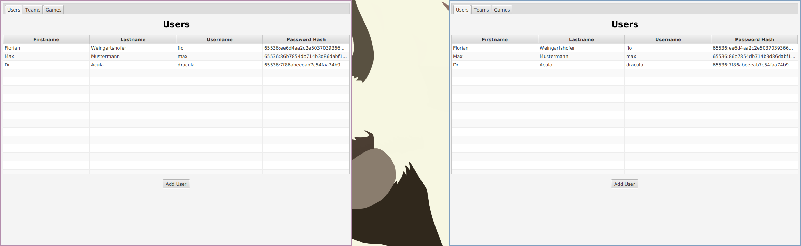

.Add User Dialog
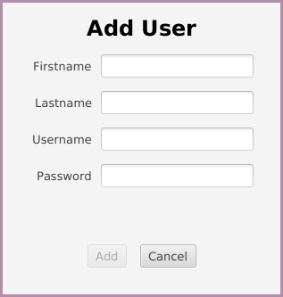

.Check For Unique Username
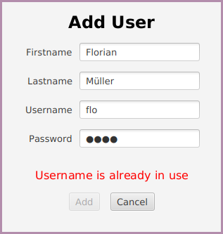

.Add User
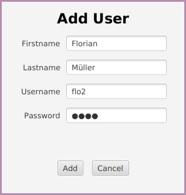

.Added User Is Available For Everyone
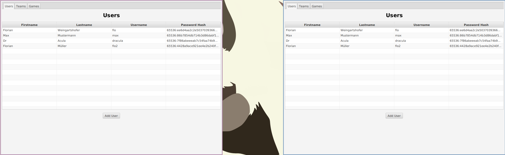

<<<
==== Add Game
.Start Add Game
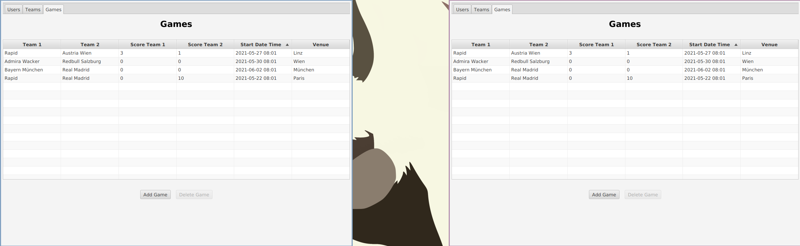

.Adding Game With Occupied Team
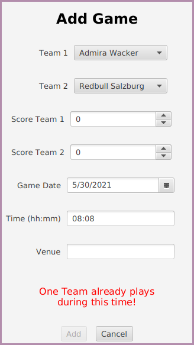

.Add Valid Game
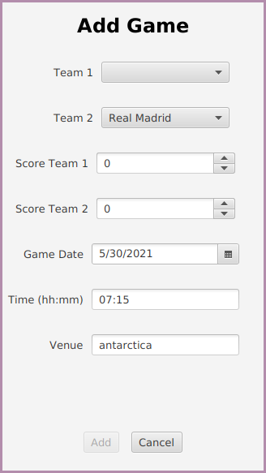

.Added Game Is Available For Everyone
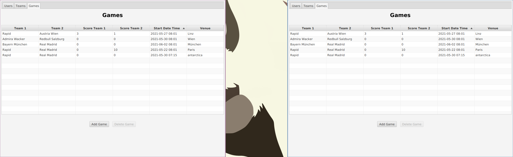

<<<
==== Update Score
.Start Update Score

.Update Score

<<<
==== Delete Game
.Start Delete Game
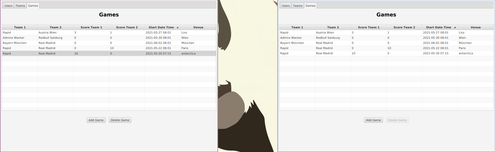

.Delete Game
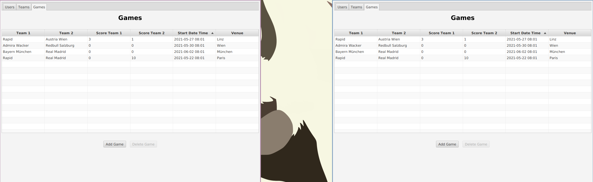

<<<
=== Bet-Application
==== Login
.Start Login
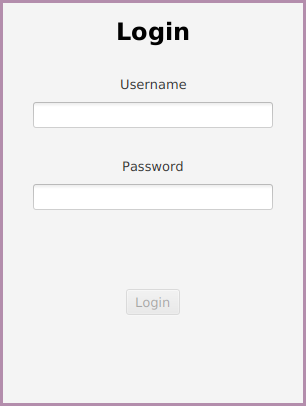

.Wrong Login
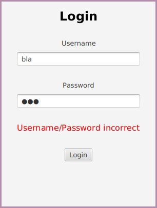

.Correct Login
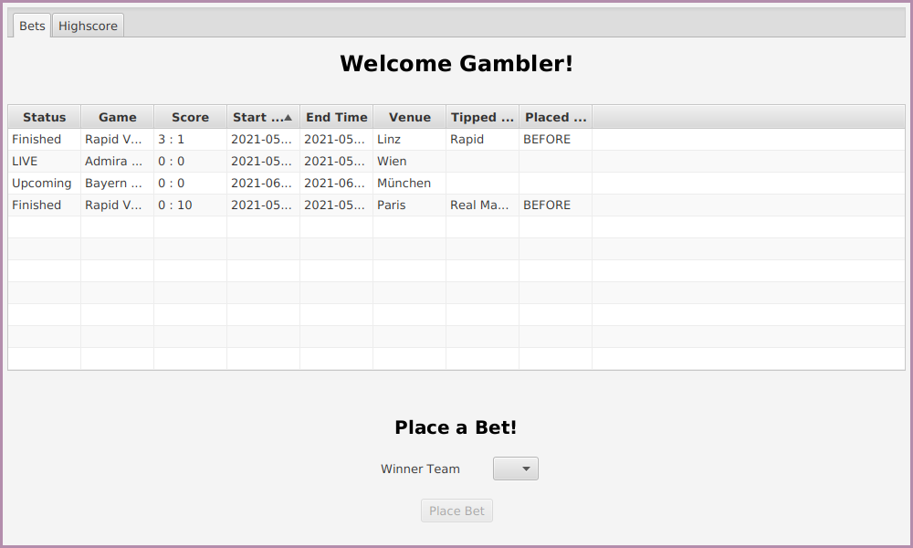

<<<
==== Place Bet
.Start Placing Bet
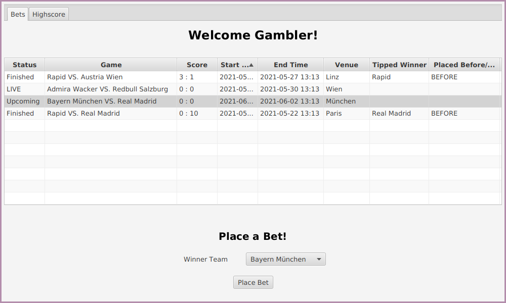

.Place Bet
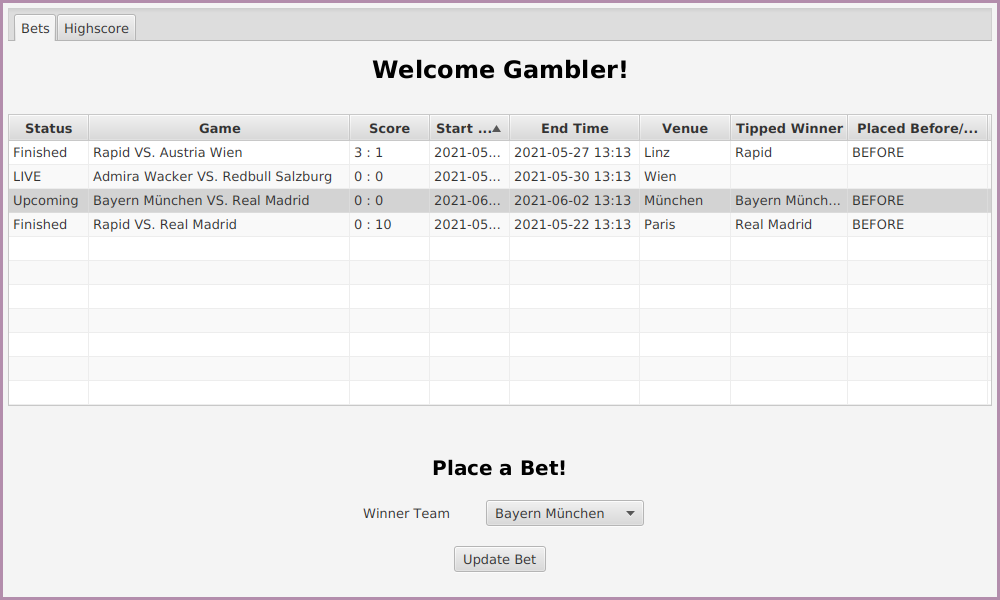

<<<
==== Update Bet
.Start Updating Bet

.Updated Bet

<<<
==== Winning Bet Changes Highscore
.Highscore Before
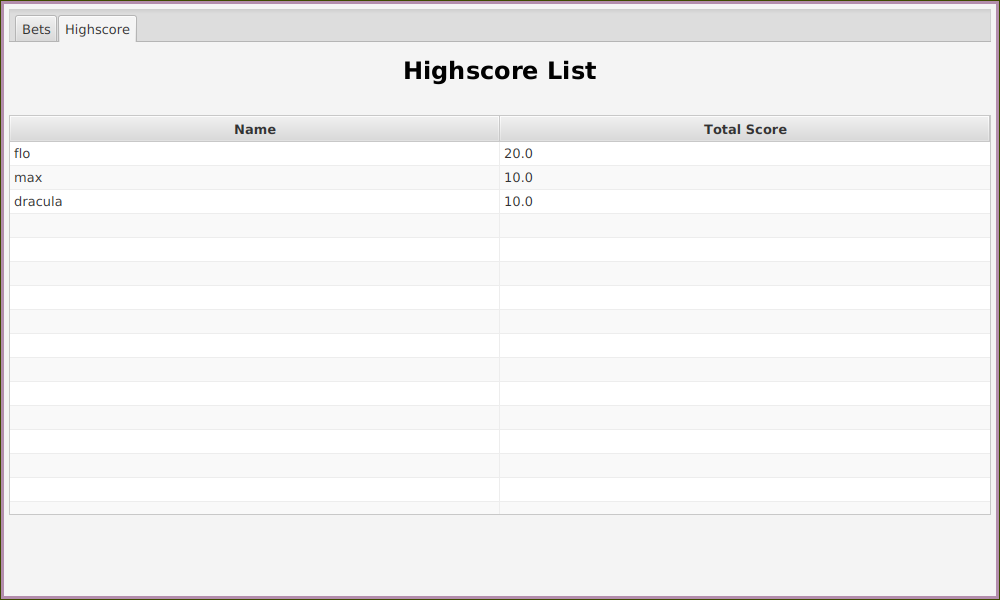

.Placed Bet
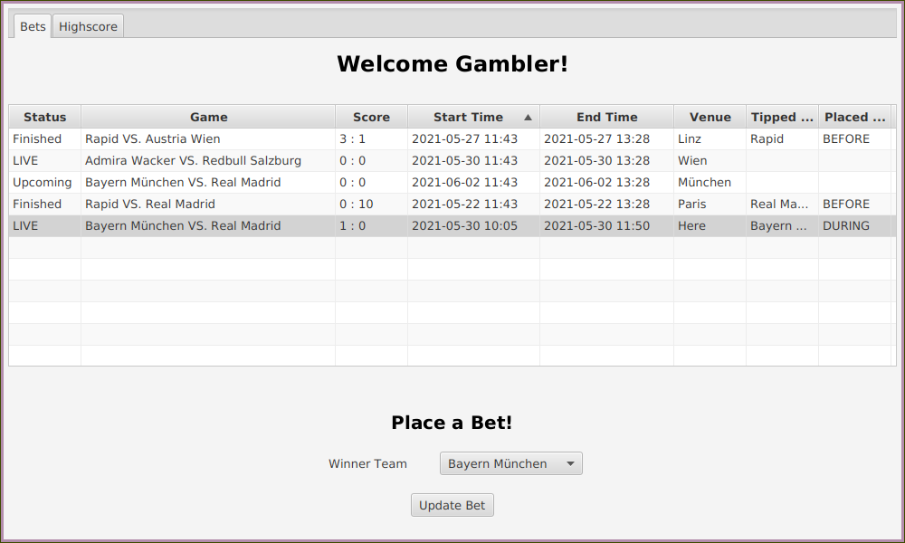

.New Highscore

<<<
=== Complex Scenarios
==== Delete Game With Bet
.Start Deleting Game With Bet
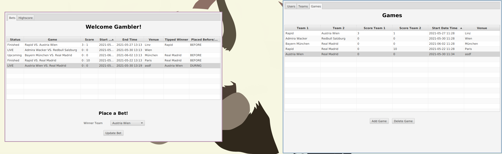

.Deleted Game
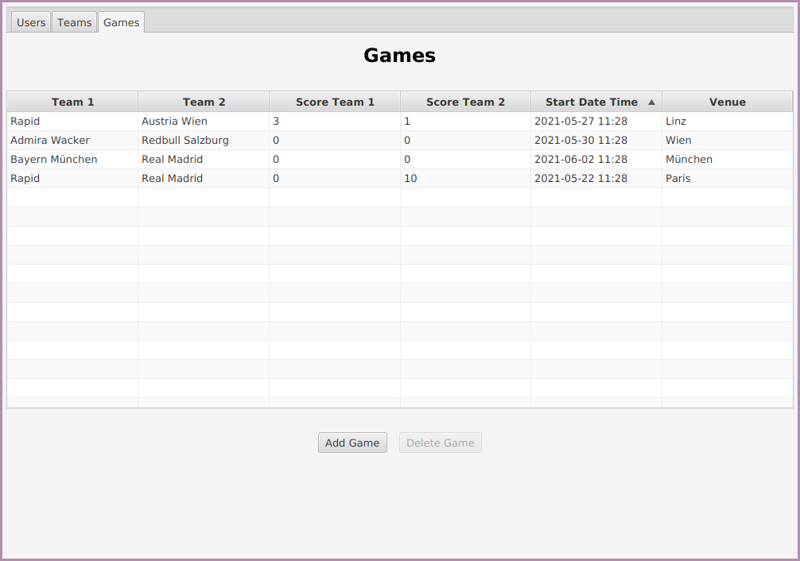

.Bet Was Deleted
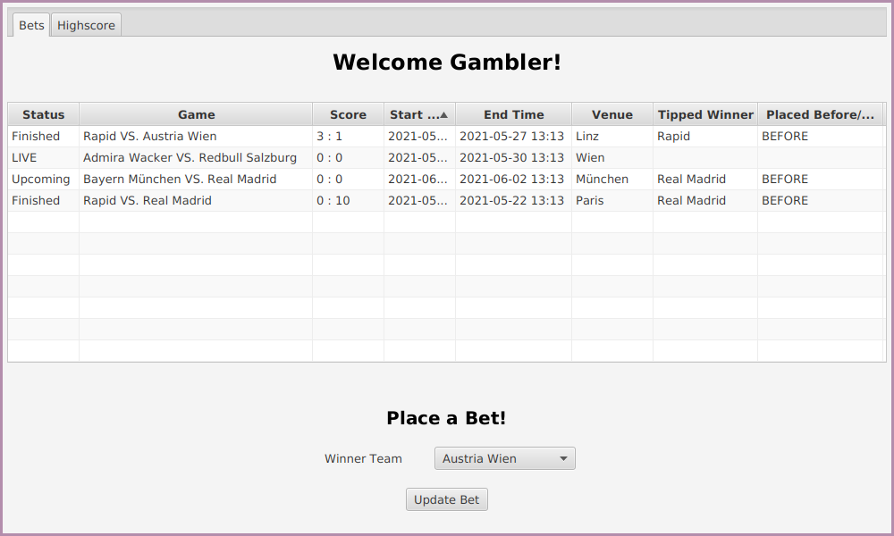
