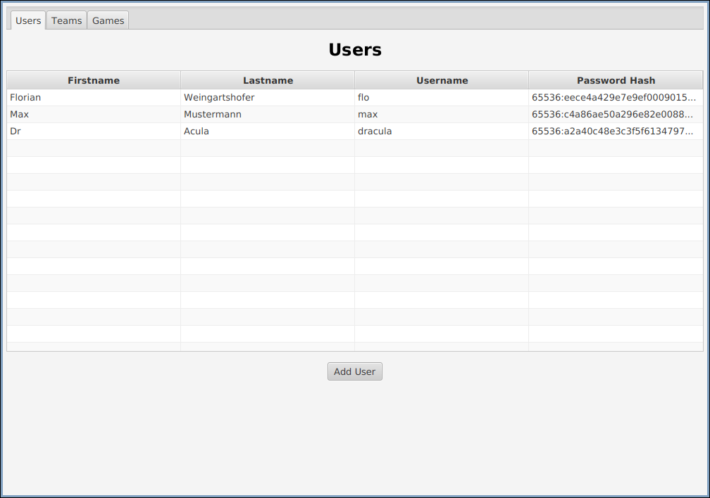

= Übung 07
:author: Florian Weingartshofer
:email: <S1910307103@students.fh-hagenberg.at>
:reproducible:
:experimental:
:listing-caption: Listing
:source-highlighter: rouge
:rouge-style: github
:toc:
:sectnums:
:sectnumlevels: 6
:toclevels: 6
// Variables
:src: ../src/euro-bet-server/src/main/java/swe4
:fxml: ../src/euro-bet-server/src/main/resources/swe4/client
:img: ./img
:imagesoutdir: ./out

<<<
== Lösungsidee
Es kann das Projekt eins zu eins übernommen werden.
Die `RepositoryFactory` ist die einzige Klasse, welche mit den konkreten Implementierungen der Repositories interagiert.
Deshalb müssen nur dort die Repositories ersetzt werden.
An der UI wurde nichts verändert, daher werden eher die Backend lastigen Features getestet.

Um die Repositories unabhängig von der SQL Datenbank zu halten, wird eine `ConnectionFactory` implementiert,
diese erstellt bei Bedarf eine neue Verbindung zur Datenbank, dafür wird die `DataSource`-Klasse genutzt.

Zur Konfiguration der Datenbank-Schnittstelle und des Data Access Layers, wird ein Properties File erstellt.
Dieses wird über den Class-Path geladen. +
Über das File kann man zwischen der Fake Repository Implementierung und der SQL Implementierung wechseln(`inMemory` oder `mysql`),
sowie die Schnittstelle der Datenbank konfigurieren.

Für die Mysql Datenbank gibt es ein create und insert Script.
Um die Datenbank zu starten, muss nur `docker-compose up` im selben Directory wie das `docker-compose.yml` ausgeführt werden.
Damit wird auch gleich das Datenbankschema erstellt und erste Testdaten eingefügt.

<<<
=== Datenbank-Schema
Das Datenbank-Schema sollte keine Überraschung sein, es sind nur ein paar Constraints dazu gekommen.

.UML Diagram
[plantuml]
....
!theme sketchy-outline
entity Team {
  * id: INT <<generated>>
  --
  * name: VARCHAR(45) <<unique>>
}

entity User {
  * id: INT <<generated>>
  --
  * firstname: VARCHAR(1000)
  * lastname: VARCHAR(1000)
  * username: VARCHAR(1000) <<unique>>
  * password: VARCHAR(255)
}

entity Game {
  * id: INT <<generated>>
  --
  * team1: INT <<FK>>
  * team2: INT <<FK>>
  * score_team1: INT = 0
  * score_team2: INT = 0
  * start_time: DATETIME
  * venue: VARCHAR(1000)
}

entity Bet {
  * id: INT <<generated>>
  --
  * user: INT <<FK>>
  * game: INT <<FK>>
  * winner_team: INT <<FK>>
  * placed: VARCHAR
}

Team ||..{ Game
Team ||..{ Game
Team ||..{ Bet
Game ||..{ Bet
User ||..{ Bet
....

<<<
== Source-Code
.ConnectionFactory.java
[source,java]
----
include::../src/euro-bet-server/src/main/java/swe4/server/ConnectionFactory.java[]
----

<<<
=== config
.DataAccessLayerConfig.java
[source,java]
----
include::../src/euro-bet-server/src/main/java/swe4/server/config/DataAccessLayerConfig.java[]
----

<<<
=== domain
.User.java
[source,java]
----
include::../src/euro-bet-server/src/main/java/swe4/domain/User.java[]
----

<<<
.Team.java
[source,java]
----
include::../src/euro-bet-server/src/main/java/swe4/domain/Team.java[]
----

<<<
.Game.java
[source,java]
----
include::../src/euro-bet-server/src/main/java/swe4/domain/Game.java[]
----

<<<
.Bet.java
[source,java]
----
include::../src/euro-bet-server/src/main/java/swe4/domain/Bet.java[]
----

.PlacementTime.java
[source,java]
----
include::../src/euro-bet-server/src/main/java/swe4/domain/PlacementTime.java[]
----

<<<
=== Repositories
.UserRepository.java
[source,java]
----
include::../src/euro-bet-server/src/main/java/swe4/server/repositories/UserRepository.java[]
----

<<<
.SqlUserRepository.java
[source,java]
----
include::../src/euro-bet-server/src/main/java/swe4/server/repositories/SqlUserRepository.java[]
----

<<<
.TeamRepository.java
[source,java]
----
include::../src/euro-bet-server/src/main/java/swe4/server/repositories/TeamRepository.java[]
----

<<<
.SqlTeamRepository.java
[source,java]
----
include::../src/euro-bet-server/src/main/java/swe4/server/repositories/SqlTeamRepository.java[]
----

<<<
.GameRepository.java
[source,java]
----
include::../src/euro-bet-server/src/main/java/swe4/server/repositories/GameRepository.java[]
----

<<<
.SqlGameRepository.java
[source,java]
----
include::../src/euro-bet-server/src/main/java/swe4/server/repositories/SqlGameRepository.java[]
----

<<<
.BetRepository.java
[source,java]
----
include::../src/euro-bet-server/src/main/java/swe4/server/repositories/BetRepository.java[]
----

<<<
.SqlBetRepository.java
[source,java]
----
include::../src/euro-bet-server/src/main/java/swe4/server/repositories/SqlBetRepository.java[]
----

<<<
.RepositoryFactory.java
[source,java]
----
include::../src/euro-bet-server/src/main/java/swe4/server/repositories/RepositoryFactory.java[]
----

<<<
=== Properties
.dataAccess.properties
[source,properties]
----
include::../src/euro-bet-server/src/main/resources/dataAccess.properties[]
----

=== Docker
.docker-compose.yml
[source,yml]
----
include::../src/euro-bet-server/docker-compose.yml[]
----

<<<
=== SQL
.DB_CREATE.sql
[source,sql]
----
include::../src/euro-bet-server/src/main/resources/sql/DB_CREATE.sql[]
----

<<<
.DB_INSERT.sql
[source,sql]
----
include::../src/euro-bet-server/src/main/resources/sql/DB_INSERT.sql[]
----

<<<
== Test Cases
=== Add User
Einen User hinzufügen.

.Test Data

Es wird versucht einen User mit demselben Usernamen hinzuzufügen.

.Non Unique Username

Nun einen validen Input eingeben.

.User with Valid Input
image::img/add_user_with_valid_input.png[]

<<<
Und der User wurde hinzugefügt.

.Added User

<<<
=== Update User
Daten von einem User müssen aktualisiert werden.

.Users

<<<
Der User wurde nun erfolgreich editiert.

.Updated User

<<<
=== Update Game
Ein bereits vorhandenes Spiel soll nun aktualisiert werden.

.All Games

<<<
Das Spiel wurde erfolgreich aktualisiert.

.Updated Game

<<<
=== Add Game
Ein Spiel soll hinzugefügt werden.

.Overlapping game

<<<
Sollte das Spiel nicht überlappen, kann es auch hinzugefügt werden.

.Valid Game

.Added Game

<<<
=== Login
Ein User möchte sich anmelden, dabei läuft die Katze über die Tastatur.

.Invalid Login

.Invalid Login Error

<<<
Der User kann nun erfolgreich seine Daten eingeben und wird angemeldet.

.Successful Login

=== Place Bet
Der User möchte nun eine Wette platzieren.

.All Bets and Games

<<<
Der User platziert seine Wette.

.Placed Bet

<<<
Dann entscheidet sich der User doch um.

.Updated Bet

<<<
=== New Highscore
Eine neue Wette wurde auf ein live Spiel platziert.

.Live Game Bet

<<<
Der momentane Highscore.

.Current Highscore

<<<
Und der neue Highscore.

.New Highscore

